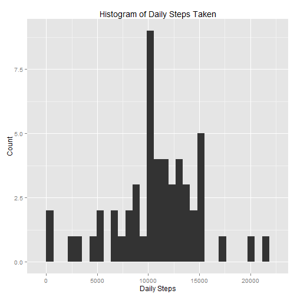
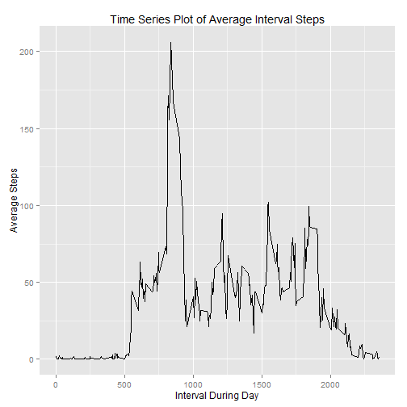
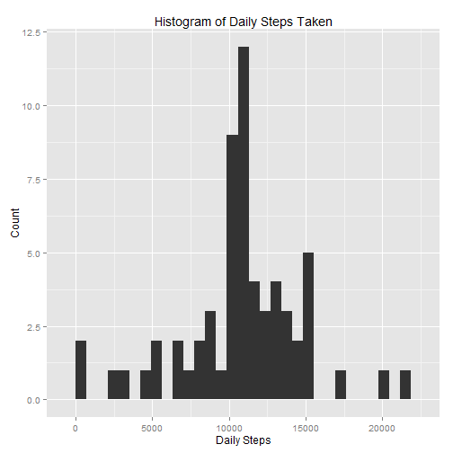
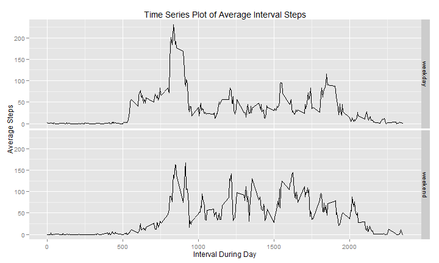

---
title: "Reproducible Research - Peer Assessment I"
author: "Jeff Hedberg"
date: "Friday, December 12, 2014"
output: html_document
---
<br>  
This report is for the Coursera "Reproducible Research" online course.  
The data used for this analysis can be found in the professor's github repository here: https://github.com/rdpeng/RepData_PeerAssessment1  
  
###The assignment is as follows:  

####A. Loading and preprocessing the data  
#####Show any code that is needed to:  
1. Load the data (i.e. read.csv())  

```r
#1. Load the data (i.e. read.csv()) 
df_data<-read.csv(file="./activity.csv", header=TRUE)
```
  
2. Process/transform the data (if necessary) into a format suitable for your analysis  

```r
#2. Process/transform the data (if necessary) into a format suitable for your analysis
df_data$date_char<-df_data$date
df_data$timestamp<-as.POSIXct(df_data$date_char, format="%Y-%m-%d") + as.difftime(df_data$interval, units="mins")
df_data$weekday<-weekdays(as.Date(df_data$date))
df_data$day_class<-ifelse(df_data$weekday == "Saturday", "weekend", ifelse(df_data$weekday == "Sunday", "weekend","weekday"))
```
  <br>  
  
####B. What is mean total number of steps taken per day?  
#####For this part of the assignment, you can ignore the missing values in the dataset:  
1. Make a histogram of the total number of steps taken each day  

```r
#1. Make a histogram of the total number of steps taken each day  
library(sqldf)
df_data_daily<-sqldf("select date_char, sum(steps) as daily_steps from df_data where steps <> 'NA' group by date_char")
library(ggplot2)
qplot(df_data_daily$daily_steps) + labs(title = "Histogram of Daily Steps Taken") + 
        labs(x="Daily Steps") + labs(y="Count")
```


  
2. Calculate and report the mean and median total number of steps taken per day 

```r
#2. Calculate and report the mean and median total number of steps taken per day
mean_daily_steps<-as.numeric(sqldf("select avg(daily_steps) from df_data_daily"))
mean_daily_steps
```

```
## [1] 10766.19
```

```r
median_daily_steps<-median(as.numeric(unlist(sqldf("select daily_steps from df_data_daily"))))
median_daily_steps
```

```
## [1] 10765
```
  <br>  
  
####C. What is the average daily activity pattern?  
1. Make a time series plot (i.e. type = "l") of the 5-minute interval (x-axis) and the average number of steps taken, averaged across all days (y-axis)  

```r
#1. Make a time series plot (i.e. type = "l") of the 5-minute interval (x-axis) and the average number of steps taken, averaged across all days (y-axis)  
df_data_without_NA<-sqldf("select interval as interval2, avg(steps) as avg_steps from df_data where steps <> 'NA' group by interval2")
qplot(interval2, avg_steps, data=df_data_without_NA, geom="line") + labs(title = "Time Series Plot of Average Interval Steps") + labs(x="Interval During Day") + labs(y="Average Steps")
```


  
2. Which 5-minute interval, on average across all the days in the dataset, contains the maximum number of steps? 

```r
#2. Which 5-minute interval, on average across all the days in the dataset, contains the maximum number of steps? 
max_interval<-as.numeric(sqldf("select interval2 from df_data_without_NA where avg_steps = (select max(avg_steps) from df_data_without_NA)"))
max_interval
```

```
## [1] 835
```
  <br>  
  
####D. Imputing missing values
#####Note that there are a number of days/intervals where there are missing values (coded as NA). The presence of missing days may introduce bias into some calculations or summaries of the data.

1. Calculate and report the total number of missing values in the dataset (i.e. the total number of rows with NA's)

```r
#1. Calculate and report the total number of missing values in the dataset (i.e. the total number of rows with NA's)
NA_count<-sum(is.na(df_data$steps))
NA_count
```

```
## [1] 2304
```

2. Devise a strategy for filling in all of the missing values in the dataset. The strategy does not need to be sophisticated. For example, you could use the mean/median for that day, or the mean for that 5-minute interval, etc.

```r
#2. Devise a strategy for filling in all of the missing values in the dataset. The strategy does not need to be sophisticated. For example, you could use the mean/median for that day, or the mean for that 5-minute interval, etc.

# =>  I choose to use the mean for the 5-minute interval over all days and replace all 'NA' values with the coresponding values rounded to integers.
```

3. Create a new dataset that is equal to the original dataset but with the missing data filled in.

```r
temp1<-sqldf("select * from df_data where steps is not null")
temp2<-sqldf("select * from df_data, df_data_without_NA where interval = interval2 and steps is null")
temp3<-sqldf("select round(avg_steps,0) as steps, date, interval2 as interval, date_char, timestamp, weekday, day_class from temp2")
df_data_replaced_NA<-rbind(temp1,temp3)
df_data_replaced_NA<-df_data_replaced_NA[order(df_data_replaced_NA$date,df_data_replaced_NA$interval),]
rownames(df_data_replaced_NA) <- NULL

#The initial dataset was called "df_data"
head(df_data,10)
```

```
##    steps       date interval  date_char           timestamp weekday day_class
## 1     NA 2012-10-01        0 2012-10-01 2012-10-01 00:00:00  Monday   weekday
## 2     NA 2012-10-01        5 2012-10-01 2012-10-01 00:05:00  Monday   weekday
## 3     NA 2012-10-01       10 2012-10-01 2012-10-01 00:10:00  Monday   weekday
## 4     NA 2012-10-01       15 2012-10-01 2012-10-01 00:15:00  Monday   weekday
## 5     NA 2012-10-01       20 2012-10-01 2012-10-01 00:20:00  Monday   weekday
## 6     NA 2012-10-01       25 2012-10-01 2012-10-01 00:25:00  Monday   weekday
## 7     NA 2012-10-01       30 2012-10-01 2012-10-01 00:30:00  Monday   weekday
## 8     NA 2012-10-01       35 2012-10-01 2012-10-01 00:35:00  Monday   weekday
## 9     NA 2012-10-01       40 2012-10-01 2012-10-01 00:40:00  Monday   weekday
## 10    NA 2012-10-01       45 2012-10-01 2012-10-01 00:45:00  Monday   weekday
```

```r
#The new dataset is called "df_data_replaced_NA"
head(df_data_replaced_NA,10)
```

```
##    steps       date interval  date_char           timestamp weekday day_class
## 1      2 2012-10-01        0 2012-10-01 2012-10-01 00:00:00  Monday   weekday
## 2      0 2012-10-01        5 2012-10-01 2012-10-01 00:05:00  Monday   weekday
## 3      0 2012-10-01       10 2012-10-01 2012-10-01 00:10:00  Monday   weekday
## 4      0 2012-10-01       15 2012-10-01 2012-10-01 00:15:00  Monday   weekday
## 5      0 2012-10-01       20 2012-10-01 2012-10-01 00:20:00  Monday   weekday
## 6      2 2012-10-01       25 2012-10-01 2012-10-01 00:25:00  Monday   weekday
## 7      1 2012-10-01       30 2012-10-01 2012-10-01 00:30:00  Monday   weekday
## 8      1 2012-10-01       35 2012-10-01 2012-10-01 00:35:00  Monday   weekday
## 9      0 2012-10-01       40 2012-10-01 2012-10-01 00:40:00  Monday   weekday
## 10     1 2012-10-01       45 2012-10-01 2012-10-01 00:45:00  Monday   weekday
```

4. Make a histogram of the total number of steps taken each day and Calculate and report the mean and median total number of steps taken per day. Do these values differ from the estimates from the first part of the assignment? What is the impact of imputing missing data on the estimates of the total daily number of steps?

```r
#4. Make a histogram of the total number of steps taken each day and Calculate and report the mean and median total number of steps taken per day. Do these values differ from the estimates from the first part of the assignment? What is the impact of imputing missing data on the estimates of the total daily number of steps?

df_data_replaced_daily<-sqldf("select date_char, sum(steps) as daily_steps from df_data_replaced_NA group by date_char")

qplot(df_data_replaced_daily$daily_steps) + labs(title = "Histogram of Daily Steps Taken") + 
        labs(x="Daily Steps") + labs(y="Count")
```



```r
mean_daily_replaced_steps<-as.numeric(sqldf("select avg(daily_steps) from df_data_replaced_daily"))
mean_daily_replaced_steps
```

```
## [1] 10765.64
```

```r
median_daily_replaced_steps<-median(as.numeric(unlist(sqldf("select daily_steps from df_data_replaced_daily"))))
median_daily_replaced_steps
```

```
## [1] 10762
```

```r
#These values didn't differ very much.  I think that this is because they are a small percentage of the whole, and also because I chose to substiture the average values for that interval.  This was a great shouce for imputing the data. Also, the mean and median values are pretty close to being identical, so that is further confirmation that this method of data imputation was a good choice.
```
  <br>  
  
####E. Are there differences in activity patterns between weekdays and weekends?
#####For this part the weekdays() function may be of some help here. Use the dataset with the filled-in missing values for this part.
1.  Create a new factor variable in the dataset with two levels -- "weekday" and "weekend" indicating whether a given date is a weekday or weekend day.


```r
#1.  Create a new factor variable in the dataset with two levels -- "weekday" and "weekend" indicating whether a given date is a weekday or weekend day.
#I created this in the initial data processing steps above.  Please refer to A-2 for this code.
```
2.  Make a panel plot containing a time series plot (i.e. type = "l") of the 5-minute interval (x-axis) and the average number of steps taken, averaged across all weekday days or weekend days (y-axis).

```r
#2.  Make a panel plot containing a time series plot (i.e. type = "l") of the 5-minute interval (x-axis) and the average number of steps taken, averaged across all weekday days or weekend days (y-axis).
df_data_replaced_NA_interval<-sqldf("select day_class, interval, avg(steps) as avg_steps from df_data_replaced_NA group by day_class, interval")
qplot(interval, avg_steps, data=df_data_replaced_NA_interval, geom="line") + labs(title = "Time Series Plot of Average Interval Steps") + labs(x="Interval During Day") + labs(y="Average Steps") + facet_grid(day_class~.)
```



```r
##There are some slight differences in Weekday vs. Weekend.  It appears that less movement happens in the morning on the weekends, this is most likely due to the person sleeping in later.  Also, the overall step count appears to be more uniform, without the traits of a peak in the begging and end of the day.  Perhaps this is because the individual typically walks to and from work, and is not the case on the weekend.
```
